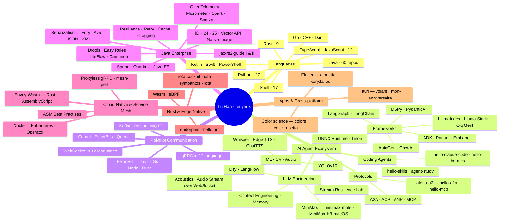

# Hi there, I'm Lu Han (feuyeux) 👋

  
  
  

## 👨‍💻 About Me

- 📖 Author of **《Java RESTful Web Service 实战》** (1st & 2nd ed.) — companion repos [jax-rs2-guide](https://github.com/feuyeux/jax-rs2-guide) & [jax-rs2-guide-II](https://github.com/feuyeux/jax-rs2-guide-II) with 350+ stars
- 🤖 Currently deep-diving the **AI Agent ecosystem** — LangGraph, DSPy, PydanticAI, AutoGen, CrewAI, and agent protocols **A2A / ACP / ANP / MCP**
- 🧪 Maintainer of the **hello-\*** series: 100 hands-on verification repos covering frameworks, protocols and runtimes — [hello-grpc](https://github.com/feuyeux/hello-grpc) implements gRPC in 12 programming languages, [hello-websocket](https://github.com/feuyeux/hello-websocket) does the same for WebSocket
- 🔌 Polyglot reactive communication practitioner — 9-repo [RSocket](https://github.com/feuyeux/hello-rsocket) series across Java / Go / Node.js / Rust, including token-based security variants
- 🦀 Building **edge-native systems in Rust** — the iota-\* series ([iota-cockpit](https://github.com/feuyeux/iota-cockpit), [iota-sympantos](https://github.com/feuyeux/iota-sympantos), [iota](https://github.com/feuyeux/iota))
- 🎧 Exploring **audio & acoustics on device** — [hello-acoustics](https://github.com/feuyeux/hello-acoustics), [hello-audio-stream](https://github.com/feuyeux/hello-audio-stream), [hello-whisper](https://github.com/feuyeux/hello-whisper), [hello-edge-tts](https://github.com/feuyeux/hello-edge-tts)
- 📝 Writing on [Alibaba Cloud Community](https://community.alibabacloud.com/users/5319351068736291) | Service Mesh best practices ([asm-best-practises](https://github.com/feuyeux/asm-best-practises))
- 📍 Beijing, China · on GitHub since 2011 · 149 public original repos and counting

## 🛠️ Tech Stack

**Languages** (ordered by repo count across public original repos)

  
  
  
  
  
  
  
  
  
  
  

**Frameworks & Platforms**

  
  
  
  
  
  
  
  

## 🗺️ Tech Stack Panorama

A bird's-eye view of the languages, frameworks, and domains across [all my repositories](https://github.com/feuyeux?tab=repositories):

## 🚀 Featured Projects

  <a href="https://github.com/feuyeux/jax-rs2-guide-II">
    <picture>
      <source media="(prefers-color-scheme: dark)" srcset="https://github-readme-stats.vercel.app/api/pin/?username=feuyeux&repo=jax-rs2-guide-II&theme=github_dark&hide_border=true" />
      
    </picture>
  </a>
  <a href="https://github.com/feuyeux/jax-rs2-guide">
    <picture>
      <source media="(prefers-color-scheme: dark)" srcset="https://github-readme-stats.vercel.app/api/pin/?username=feuyeux&repo=jax-rs2-guide&theme=github_dark&hide_border=true" />
      
    </picture>
  </a>
  <a href="https://github.com/feuyeux/hello-grpc">
    <picture>
      <source media="(prefers-color-scheme: dark)" srcset="https://github-readme-stats.vercel.app/api/pin/?username=feuyeux&repo=hello-grpc&theme=github_dark&hide_border=true" />
      
    </picture>
  </a>
  <a href="https://github.com/feuyeux/hello-langgraph">
    <picture>
      <source media="(prefers-color-scheme: dark)" srcset="https://github-readme-stats.vercel.app/api/pin/?username=feuyeux&repo=hello-langgraph&theme=github_dark&hide_border=true" />
      
    </picture>
  </a>
  <a href="https://github.com/feuyeux/hello-langchain">
    <picture>
      <source media="(prefers-color-scheme: dark)" srcset="https://github-readme-stats.vercel.app/api/pin/?username=feuyeux&repo=hello-langchain&theme=github_dark&hide_border=true" />
      
    </picture>
  </a>
  <a href="https://github.com/feuyeux/hello-rsocket">
    <picture>
      <source media="(prefers-color-scheme: dark)" srcset="https://github-readme-stats.vercel.app/api/pin/?username=feuyeux&repo=hello-rsocket&theme=github_dark&hide_border=true" />
      
    </picture>
  </a>
  <a href="https://github.com/feuyeux/asm-best-practises">
    <picture>
      <source media="(prefers-color-scheme: dark)" srcset="https://github-readme-stats.vercel.app/api/pin/?username=feuyeux&repo=asm-best-practises&theme=github_dark&hide_border=true" />
      
    </picture>
  </a>
  <a href="https://github.com/feuyeux/kio">
    <picture>
      <source media="(prefers-color-scheme: dark)" srcset="https://github-readme-stats.vercel.app/api/pin/?username=feuyeux&repo=kio&theme=github_dark&hide_border=true" />
      
    </picture>
  </a>

## 📊 GitHub Stats

  <a href="https://github.com/anuraghazra/github-readme-stats">
    <picture>
      <source media="(prefers-color-scheme: dark)" srcset="https://github-readme-stats.vercel.app/api?username=feuyeux&show_icons=true&theme=github_dark&hide_border=true&include_all_commits=true&count_private=true" />
      
    </picture>
  </a>
  <a href="https://git.io/streak-stats">
    <picture>
      <source media="(prefers-color-scheme: dark)" srcset="https://streak-stats.demolab.com?user=feuyeux&theme=dark&hide_border=true" />
      
    </picture>
  </a>

  <a href="https://github.com/anuraghazra/github-readme-stats">
    <picture>
      <source media="(prefers-color-scheme: dark)" srcset="https://github-readme-stats.vercel.app/api/top-langs/?username=feuyeux&hide=html,css&langs_count=12&layout=pie&theme=github_dark&hide_border=true" />
      
    </picture>
  </a>

  <a href="https://github.com/ashutosh00710/github-readme-activity-graph">
    <picture>
      <source media="(prefers-color-scheme: dark)" srcset="https://github-readme-activity-graph.vercel.app/graph?username=feuyeux&theme=github-dark&hide_border=true" />
      
    </picture>
  </a>

## 🏆 GitHub Trophies

  <a href="https://github.com/ryo-ma/github-profile-trophy">
    <picture>
      <source media="(prefers-color-scheme: dark)" srcset="https://github-profile-trophy.vercel.app/?username=feuyeux&row=2&column=10&theme=onedark&no-frame=true" />
      
    </picture>
  </a>

## 🐍 Contribution Snake

  <picture>
    <source media="(prefers-color-scheme: dark)" srcset="https://raw.githubusercontent.com/feuyeux/feuyeux/output/github-contribution-grid-snake-dark.svg" />
    <source media="(prefers-color-scheme: light)" srcset="https://raw.githubusercontent.com/feuyeux/feuyeux/output/github-contribution-grid-snake.svg" />
    
  </picture>

## 🔗 Connect with Me

  
  
  

