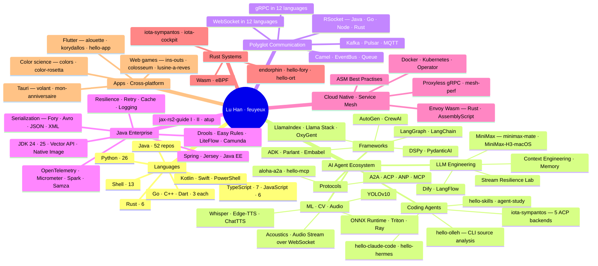

# Hi there, I'm Lu Han (feuyeux) 👋

  
  
  

## 👨‍💻 About Me

- 📖 Author of **《Java RESTful Web Service 实战》** (1st & 2nd ed.) — companion repos [jax-rs2-guide](https://github.com/feuyeux/jax-rs2-guide), [jax-rs2-guide-II](https://github.com/feuyeux/jax-rs2-guide-II) and [jax-rs2-atup](https://github.com/feuyeux/jax-rs2-atup), 380+ stars combined
- 🤖 Deep-diving the **AI Agent ecosystem** across 33 repos — LangChain / LangGraph / LlamaIndex / DSPy / PydanticAI / AutoGen / CrewAI / ADK / Parlant / Embabel / OxyGent, the agent protocols **A2A · ACP · ANP · MCP**, and coding-agent labs [hello-claude-code](https://github.com/feuyeux/hello-claude-code), [hello-skills](https://github.com/feuyeux/hello-skills), [hello-hermes](https://github.com/feuyeux/hello-hermes)
- 🧪 Maintainer of the **hello-\*** series — 99 runnable verification repos (of 149 public originals) covering frameworks, protocols and runtimes
- 🌐 **Polyglot communication** practitioner — [hello-grpc](https://github.com/feuyeux/hello-grpc) implements gRPC in 12 programming languages, [hello-websocket](https://github.com/feuyeux/hello-websocket) does the same for WebSocket, plus a 9-repo [RSocket](https://github.com/feuyeux/hello-rsocket) series across Java / Go / Node.js / Rust with token-based security variants
- 🦀 Building **systems in Rust** — [iota-sympantos](https://github.com/xp-iota/iota-sympantos) (see Current Focus), [iota-cockpit](https://github.com/feuyeux/iota-cockpit), [endorphin](https://github.com/feuyeux/endorphin), [hello-fory](https://github.com/feuyeux/hello-fory), [hello-ort](https://github.com/feuyeux/hello-ort), [rust-wasm-4-envoy](https://github.com/feuyeux/rust-wasm-4-envoy)
- 🎧 Exploring **audio & acoustics on device** — [hello-acoustics](https://github.com/feuyeux/hello-acoustics), [hello-audio-stream](https://github.com/feuyeux/hello-audio-stream), [hello-whisper](https://github.com/feuyeux/hello-whisper), [hello-edge-tts](https://github.com/feuyeux/hello-edge-tts), [hello-chat-tts](https://github.com/feuyeux/hello-chat-tts)
- ☁️ **Cloud native & Service Mesh** — [asm-best-practises](https://github.com/feuyeux/asm-best-practises), [hello-servicemesh-grpc](https://github.com/feuyeux/hello-servicemesh-grpc), [grpc_proxyless](https://github.com/feuyeux/grpc_proxyless), [mesh-perf](https://github.com/feuyeux/mesh-perf), Envoy Wasm filters in Rust and AssemblyScript
- 🎨 **Cross-platform apps & creative coding** — Tauri ([volant](https://github.com/feuyeux/volant), [mon-anniversaire](https://github.com/feuyeux/mon-anniversaire)), Flutter ([alouette](https://github.com/feuyeux/alouette), [korydallos](https://github.com/feuyeux/korydallos), [hello-app](https://github.com/feuyeux/hello-app)), color science ([colors](https://github.com/feuyeux/colors), [color-rosetta](https://github.com/feuyeux/color-rosetta))
- 📝 Writing on [Alibaba Cloud Community](https://community.alibabacloud.com/users/5319351068736291)
- 📍 Beijing, China · on GitHub since 2011 · 149 public original repos · 494 stars earned

## 🔭 Current Focus

My most recent work lives in the [**xp-iota**](https://github.com/xp-iota) organisation:

- 🛰️ **[iota-sympantos](https://github.com/xp-iota/iota-sympantos)** — a cross-platform **Rust** CLI/TUI that routes prompts to five ACP backends (claude-code / codex / gemini / hermes / opencode) on top of one shared memory, skills and context layer. SQLite-backed cross-backend memory (SHA-256 dedup, FTS5, 6 recall buckets), YAML-declared deterministic skills dispatched by a Rust engine, `iota-fun` snippet runner for 7 languages, a built-in Kanban with event sourcing for long-running agent tasks, a loopback-only warm daemon with owner-only token auth, and a ratatui inline TUI. ~1.4 MB of Rust plus a TypeScript surface.
- 📚 **[hello-olleh](https://github.com/xp-iota/hello-olleh)** — a source-reading and comparison workspace for AI coding CLIs. Upstream snapshots of claude-code, codex, gemini-cli, opencode, hermes-agent, nanobot, cordis and deepseek-harness, paired with Markdown analyses of their startup paths, agent scheduling, tool systems, state management and extension mechanisms — plus a streaming-agent resilience study across all snapshots.

**Merged upstream contributions** — [parlant#634](https://github.com/emcie-co/parlant/pull/634) ZhiPuAI NLP adapter · [awesome-grpc#198](https://github.com/grpc-ecosystem/awesome-grpc/pull/198) Hello gRPC samples · [Starship#180](https://github.com/tricorder-observability/Starship/pull/180) graceful streaming reconnect · [flagger#798](https://github.com/fluxcd/flagger/pull/798) Flagger on Alibaba Cloud ASM · [piano_teacher#1](https://github.com/Z0nghe/piano_teacher/pull/1) portable launcher scripts

## 📦 Repository Landscape

How the [149 public original repositories](https://github.com/feuyeux?tab=repositories) on this account break down by domain (the [xp-iota](https://github.com/xp-iota) projects above are counted separately):

| Domain | Repos | Representative work |
| --- | :---: | --- |
| AI Agents & LLM Engineering | 33 | [hello-langchain](https://github.com/feuyeux/hello-langchain) · [hello-langgraph](https://github.com/feuyeux/hello-langgraph) · [hello-mcp](https://github.com/feuyeux/hello-mcp) · [aloha-a2a](https://github.com/feuyeux/aloha-a2a) · [stream-resilience-lab](https://github.com/feuyeux/stream-resilience-lab) |
| Polyglot RPC & Messaging | 19 | [hello-grpc](https://github.com/feuyeux/hello-grpc) · [hello-websocket](https://github.com/feuyeux/hello-websocket) · [hello-rsocket](https://github.com/feuyeux/hello-rsocket) · [hello-kafka](https://github.com/feuyeux/hello-kafka) · [hello-pulsar](https://github.com/feuyeux/hello-pulsar) |
| Apps & Creative Coding | 18 | [volant](https://github.com/feuyeux/volant) · [alouette](https://github.com/feuyeux/alouette) · [ins-outs](https://github.com/feuyeux/ins-outs) · [colors](https://github.com/feuyeux/colors) · [lusine-a-reves](https://github.com/feuyeux/lusine-a-reves) |
| Cloud Native & Service Mesh | 13 | [asm-best-practises](https://github.com/feuyeux/asm-best-practises) · [mesh-perf](https://github.com/feuyeux/mesh-perf) · [hello-operator](https://github.com/feuyeux/hello-operator) · [hello-wasm-ebpf](https://github.com/feuyeux/hello-wasm-ebpf) |
| ML · CV · Audio | 12 | [hello-onnx](https://github.com/feuyeux/hello-onnx) · [hello-triton](https://github.com/feuyeux/hello-triton) · [hello-yolov10](https://github.com/feuyeux/hello-yolov10) · [hello-whisper](https://github.com/feuyeux/hello-whisper) |
| Rust Systems | 6 | [iota-cockpit](https://github.com/feuyeux/iota-cockpit) · [endorphin](https://github.com/feuyeux/endorphin) · [hello-fory](https://github.com/feuyeux/hello-fory) · [hello-rsocket-rust](https://github.com/feuyeux/hello-rsocket-rust) |
| Book Companions | 3 | [jax-rs2-guide](https://github.com/feuyeux/jax-rs2-guide) · [jax-rs2-guide-II](https://github.com/feuyeux/jax-rs2-guide-II) · [jax-rs2-atup](https://github.com/feuyeux/jax-rs2-atup) |

The remainder is Java enterprise and JVM engineering — rules engines and workflow ([hello-drools](https://github.com/feuyeux/hello-drools), [hello-easy-rules](https://github.com/feuyeux/hello-easy-rules), [hello-liteflow](https://github.com/feuyeux/hello-liteflow), [hello-camunda](https://github.com/feuyeux/hello-camunda)), resilience and observability ([hello-resilience](https://github.com/feuyeux/hello-resilience), [hello-retry](https://github.com/feuyeux/hello-retry), [hello-opentelemetry](https://github.com/feuyeux/hello-opentelemetry), [hello-micrometer](https://github.com/feuyeux/hello-micrometer)), serialization ([hello-serialized](https://github.com/feuyeux/hello-serialized), [hello-avro](https://github.com/feuyeux/hello-avro), [hello-json](https://github.com/feuyeux/hello-json), [hello-xml](https://github.com/feuyeux/hello-xml)) and modern JVM features ([hello-jdk24](https://github.com/feuyeux/hello-jdk24), [hello-jdk25](https://github.com/feuyeux/hello-jdk25), [hello-vector-api](https://github.com/feuyeux/hello-vector-api), [hello-java-native](https://github.com/feuyeux/hello-java-native)).

## 🛠️ Tech Stack

**Languages** — badge order follows the primary-language count of my public original repos: Java 52 · Python 26 · Shell 13 · TypeScript 7 · JavaScript 6 · Rust 6 · Go 3 · C++ 3 · Dart 3 · HTML 3 · Jupyter 2 · Kotlin / Swift / PowerShell / CSS 1 each.

  
  
  
  
  
  
  
  
  
  
  

**Frameworks & Platforms**

  
  
  
  
  
  
  
  
  
  

<b>🗺️ Tech Stack Panorama</b> — a bird's-eye mindmap of every domain

## 🚀 Featured Projects

  <a href="https://github.com/xp-iota/iota-sympantos">
    <picture>
      <source media="(prefers-color-scheme: dark)" srcset="https://github-readme-stats.vercel.app/api/pin/?username=xp-iota&repo=iota-sympantos&theme=github_dark&hide_border=true" />
      
    </picture>
  </a>
  <a href="https://github.com/xp-iota/hello-olleh">
    <picture>
      <source media="(prefers-color-scheme: dark)" srcset="https://github-readme-stats.vercel.app/api/pin/?username=xp-iota&repo=hello-olleh&theme=github_dark&hide_border=true" />
      
    </picture>
  </a>
  <a href="https://github.com/feuyeux/jax-rs2-guide-II">
    <picture>
      <source media="(prefers-color-scheme: dark)" srcset="https://github-readme-stats.vercel.app/api/pin/?username=feuyeux&repo=jax-rs2-guide-II&theme=github_dark&hide_border=true" />
      
    </picture>
  </a>
  <a href="https://github.com/feuyeux/jax-rs2-guide">
    <picture>
      <source media="(prefers-color-scheme: dark)" srcset="https://github-readme-stats.vercel.app/api/pin/?username=feuyeux&repo=jax-rs2-guide&theme=github_dark&hide_border=true" />
      
    </picture>
  </a>
  <a href="https://github.com/feuyeux/hello-grpc">
    <picture>
      <source media="(prefers-color-scheme: dark)" srcset="https://github-readme-stats.vercel.app/api/pin/?username=feuyeux&repo=hello-grpc&theme=github_dark&hide_border=true" />
      
    </picture>
  </a>
  <a href="https://github.com/feuyeux/hello-websocket">
    <picture>
      <source media="(prefers-color-scheme: dark)" srcset="https://github-readme-stats.vercel.app/api/pin/?username=feuyeux&repo=hello-websocket&theme=github_dark&hide_border=true" />
      
    </picture>
  </a>
  <a href="https://github.com/feuyeux/hello-langchain">
    <picture>
      <source media="(prefers-color-scheme: dark)" srcset="https://github-readme-stats.vercel.app/api/pin/?username=feuyeux&repo=hello-langchain&theme=github_dark&hide_border=true" />
      
    </picture>
  </a>
  <a href="https://github.com/feuyeux/hello-langgraph">
    <picture>
      <source media="(prefers-color-scheme: dark)" srcset="https://github-readme-stats.vercel.app/api/pin/?username=feuyeux&repo=hello-langgraph&theme=github_dark&hide_border=true" />
      
    </picture>
  </a>
  <a href="https://github.com/feuyeux/hello-rsocket">
    <picture>
      <source media="(prefers-color-scheme: dark)" srcset="https://github-readme-stats.vercel.app/api/pin/?username=feuyeux&repo=hello-rsocket&theme=github_dark&hide_border=true" />
      
    </picture>
  </a>
  <a href="https://github.com/feuyeux/kio">
    <picture>
      <source media="(prefers-color-scheme: dark)" srcset="https://github-readme-stats.vercel.app/api/pin/?username=feuyeux&repo=kio&theme=github_dark&hide_border=true" />
      
    </picture>
  </a>
  <a href="https://github.com/feuyeux/asm-best-practises">
    <picture>
      <source media="(prefers-color-scheme: dark)" srcset="https://github-readme-stats.vercel.app/api/pin/?username=feuyeux&repo=asm-best-practises&theme=github_dark&hide_border=true" />
      
    </picture>
  </a>

## 📊 GitHub Stats

  <a href="https://github.com/anuraghazra/github-readme-stats">
    <picture>
      <source media="(prefers-color-scheme: dark)" srcset="https://github-readme-stats.vercel.app/api?username=feuyeux&show_icons=true&theme=github_dark&hide_border=true&include_all_commits=true&count_private=true" />
      
    </picture>
  </a>
  <a href="https://git.io/streak-stats">
    <picture>
      <source media="(prefers-color-scheme: dark)" srcset="https://streak-stats.demolab.com?user=feuyeux&theme=dark&hide_border=true" />
      
    </picture>
  </a>

  <a href="https://github.com/anuraghazra/github-readme-stats">
    <picture>
      <source media="(prefers-color-scheme: dark)" srcset="https://github-readme-stats.vercel.app/api/top-langs/?username=feuyeux&hide=html,css&langs_count=12&layout=pie&theme=github_dark&hide_border=true" />
      
    </picture>
  </a>

  <a href="https://github.com/ashutosh00710/github-readme-activity-graph">
    <picture>
      <source media="(prefers-color-scheme: dark)" srcset="https://github-readme-activity-graph.vercel.app/graph?username=feuyeux&theme=github-dark&hide_border=true" />
      
    </picture>
  </a>

  <a href="https://github.com/ryo-ma/github-profile-trophy">
    <picture>
      <source media="(prefers-color-scheme: dark)" srcset="https://github-profile-trophy.vercel.app/?username=feuyeux&row=2&column=10&theme=onedark&no-frame=true" />
      
    </picture>
  </a>

  <picture>
    <source media="(prefers-color-scheme: dark)" srcset="https://raw.githubusercontent.com/feuyeux/feuyeux/output/github-contribution-grid-snake-dark.svg" />
    <source media="(prefers-color-scheme: light)" srcset="https://raw.githubusercontent.com/feuyeux/feuyeux/output/github-contribution-grid-snake.svg" />
    
  </picture>

## 🔗 Connect with Me

  
  
  

Repository figures snapshot: 2026-09-15 — 168 public repos on this account = 149 originals + 19 forks, 494 stars, 288 followers; plus 2 public repos in the <a href="https://github.com/xp-iota">xp-iota</a> org and 5 merged upstream pull requests. Counts are derived from the GitHub API, primary language per repo.
